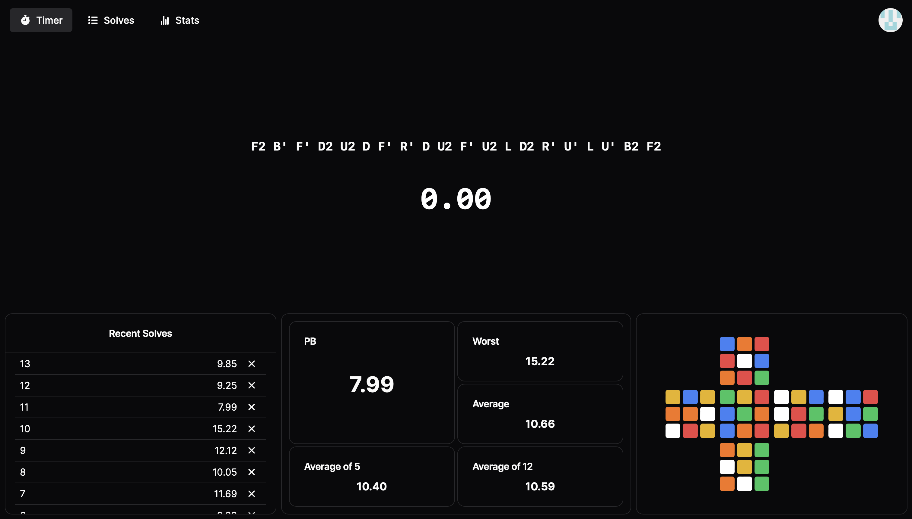

## Cube Timer

Cube Timer is an application for speedcubers to record their solve times and visualize their statistics.

URL: https://cube-timer-next.vercel.app/

## Features

- Modern and responsive design
- User authentication using credentials and OAuth providers
- Solves stored in PostgreSQL database for persistent sessions
- Cube visuals to display scramble
- Detailed statistics for previous solves (personal best, averages)
- Theme selection

## Planned Features

- Demo mode to allow usage when user is not logged in
- Functionality for more cube sizes
- More themes to choose from

## Architecture

- Next.js
- NextAuth
- Prisma
- TanStack Query
- Zustand
- TailwindCSS
- shadcn-ui
